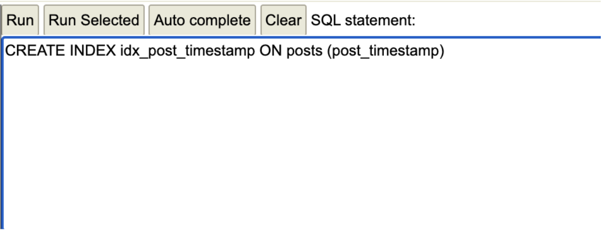
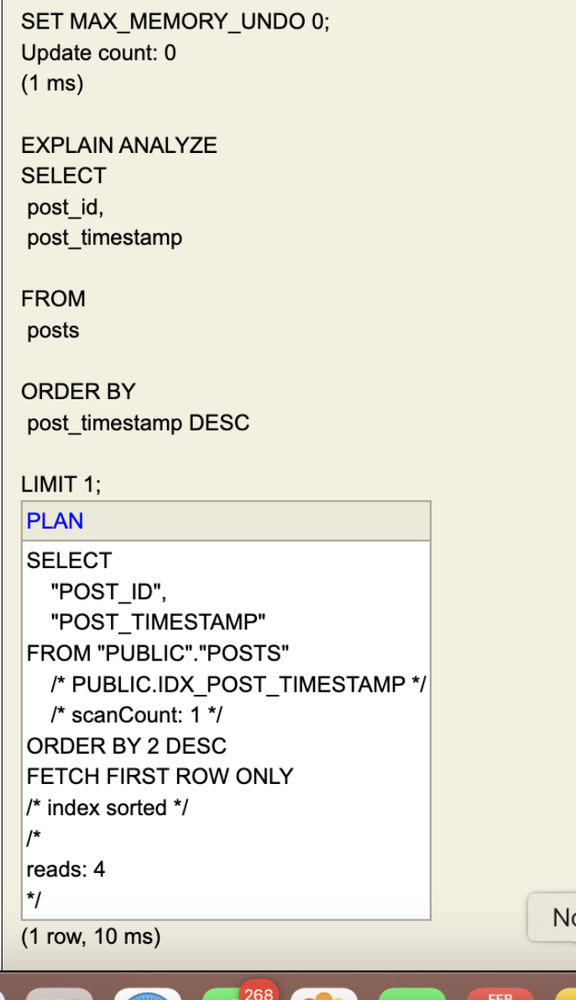
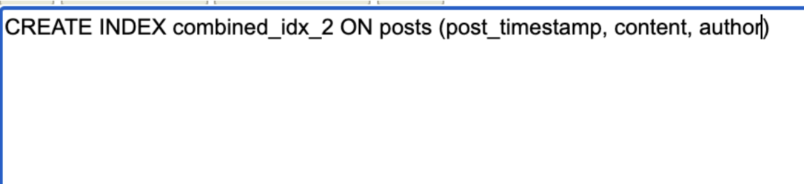
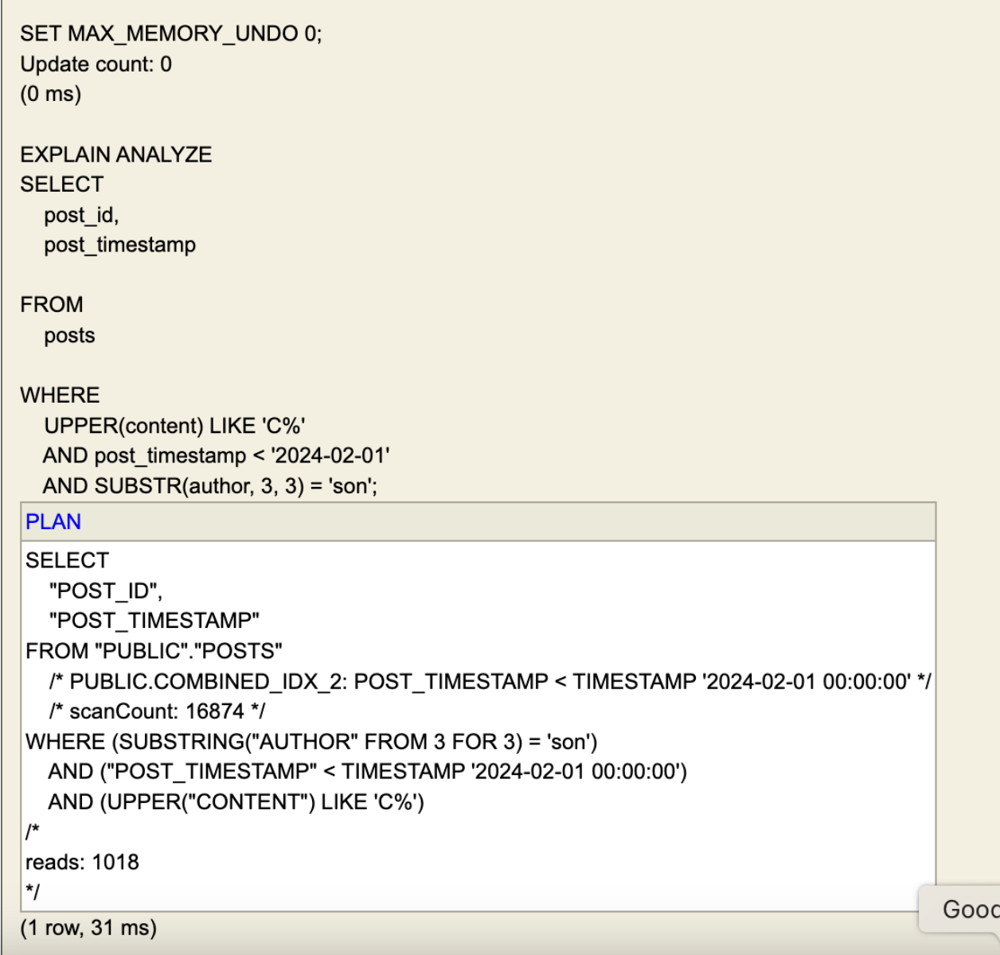
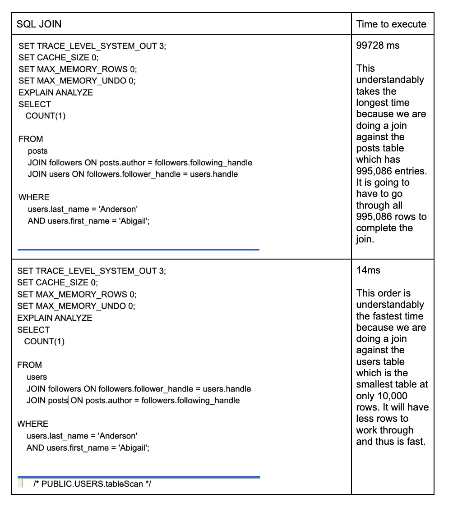
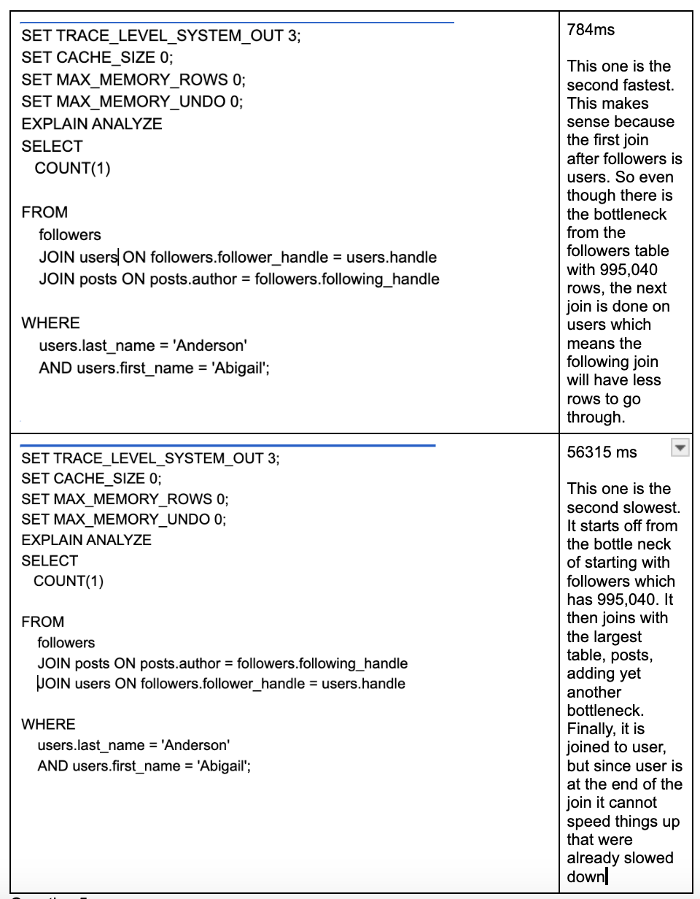

## Problem 1 - Recent Posts 
 
<change you made>
Change that I made: I added an index to the time stamp to help the order by clause

 
<screenshot of EXPLAIN ANALYZE>

 
## Problem 2 - Somewhat Strange Query
 
<change you made>
 Trying to organize all WHERE constraints ahead of time so that they are all there ready to go for grabbing.
 

<screenshot of EXPLAIN ANALYZE>

 
## Problem 3 - Really Fast Single Row Responses
### Problem 3.1 
 
<What index does H2DB end up using?  Explain the pros and cons of each index that you created.>
For some reason H2DB ended up using my B+ tree index instead of the hash index. Upon further research I found out the h2db can't make anything else but B trees. But it was weird cause I could still make a hash index. Jusst to check I tried using each index seprately. As expected, the hash index was faster than the normal index because it takes O(1) to do the quick look up needed for this query. A hash index in general is really good for grabbing one thing or search one row. It cannot be used for finding ranges, prefix look ups, or partial composite look ups. A normal index (B+ tree) is a good all around index that is flexible and well rounded. It is slower than hash indexes for searches (it takes O(logn)) BUT it can do ranges, like prefixes, partial composite indices. Both are good for join functions. Updating a B+ tree is much more efficent than updating a hash.
 
### Problem 3.2 

<Which of the indexes that you created for 3.1 would you expect to be used now.  Please explain.>
For the between timesteps I expected h2 to use the B tree index. That is because the hash index is not good for finding a range of rows whereas the B+ tree does a reallly good job at that, especaially if its leaves are doubly linked. 
 
### Problem 3.3
 
<Can you modify one of the indexes from 3.2 to make this query even faster?  Explain why your change to the index made the query even faster.>
You can modify the b+ index to include content: CREATE INDEX combination_2_idx ON posts(post_timestamp, content)
Now I have a composite tree wiwth both content and timestamp. Since we want to grab content with timestamp, adding it to the B+ tree will prevent having to go to a look up table all over again. You will be able to just grab it there. 
 
## Problem 4 - Table Join Order
### Problem 4.1 
 
<Your modified query here>
SET TRACE_LEVEL_SYSTEM_OUT 3l
SET CACHE_SIZE 0;
SET MAX_MEMORY_ROWS 0;
SET MAX_MEMORY_UNDO 0;
EXPLAIN ANALYZE
SELECT
    COUNT(1)

FROM
    users
    JOIN followers ON followers.follower_handle=users.handle
    JOIN posts ON posts.author = followers.following_handle

WHERE
    users.last_name = 'Anderson'
    AND users.first_name = 'Abigail';
 
### Problem 4.2
 
<List each of the four possible join orders and explain why or why not that particular join order will perform well or poorly.

>
 
## Problem 5 - Putting it All Together - Fast Most Recent Posts 
 
<your query here>

CREATE INDEX idx_follower_handle ON followers(follower_handle);
CREATE INDEX idx_following_handle ON followers(following_handle);
CREATE INDEX idx_author_timestamp_id_content ON posts(author, post_timestamp DESC, post_id, content);

SET TRACE_LEVEL_SYSTEM_OUT 3;
SET CACHE_SIZE 0;
SET MAX_MEMORY_ROWS 0;
SET MAX_MEMORY_UNDO 0;
EXPLAIN ANALYZE
WITH most_recent_post AS (
SELECT 
        posts.post_id, 
        posts.author,
        posts.post_timestamp, 
        posts.content, 
        ROW_NUMBER() OVER (PARTITION BY posts.author ORDER BY posts.post_timestamp DESC) AS row_num
    FROM followers
    JOIN posts ON posts.author = followers.following_handle
    WHERE followers.follower_handle = 'madison.anderson9901'
) 
SELECT  
most_recent_post.post_id,  
most_recent_post.author, 
most_recent_post.post_timestamp,  
most_recent_post.content
FROM 
most_recent_post
WHERE 
most_recent_post.row_num = 1
ORDER BY 
most_recent_post.post_timestamp DESC;

Details & Information
Assessment due date
2/28/25, 11:59 PM (EST)
Grading
Maximum points
100 points
×
