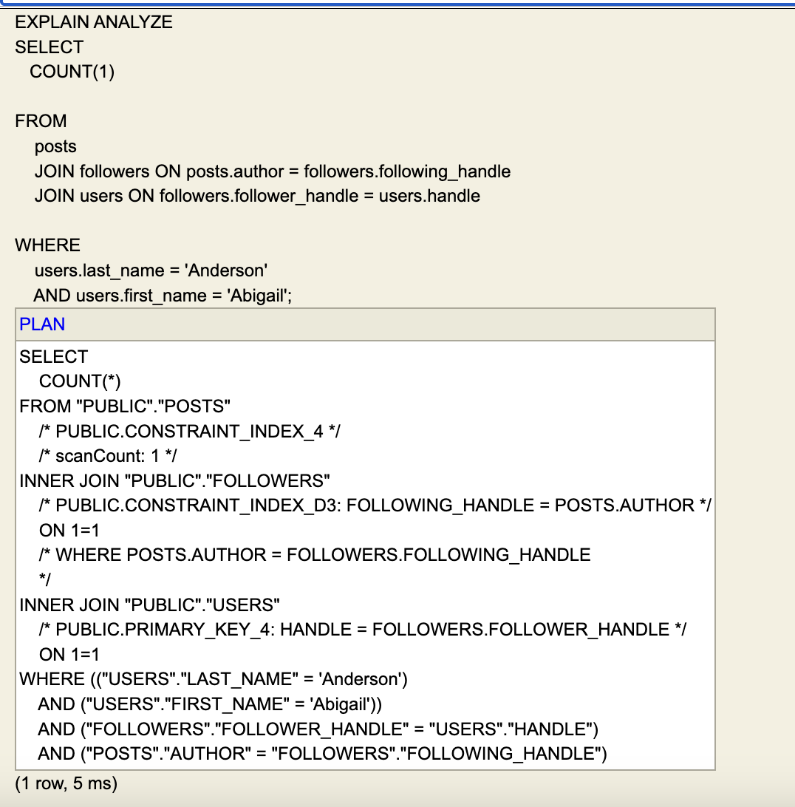
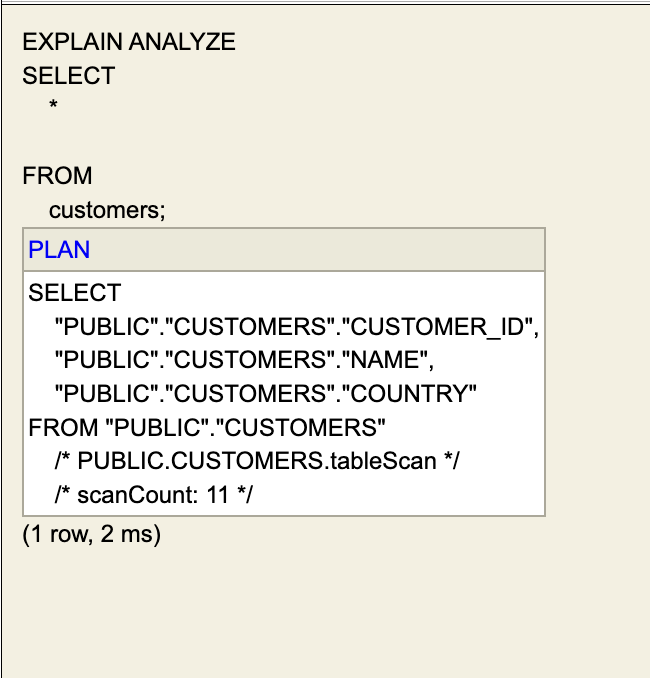
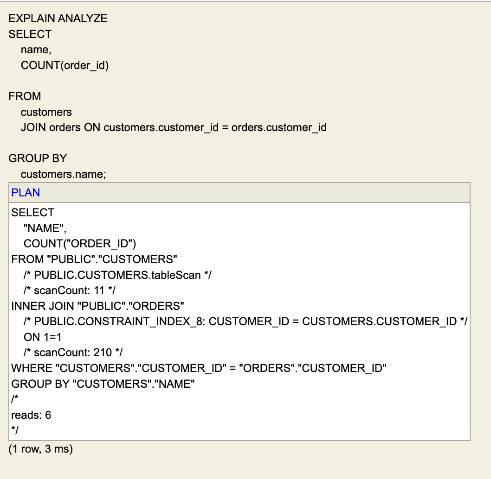
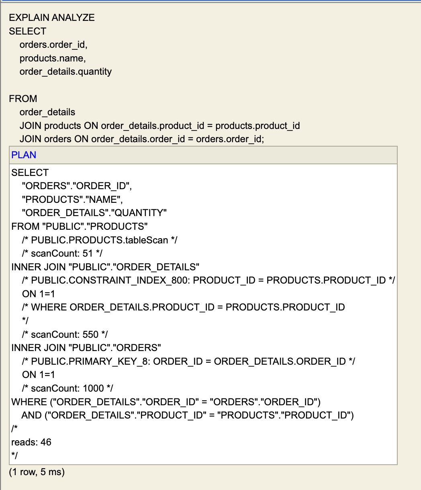
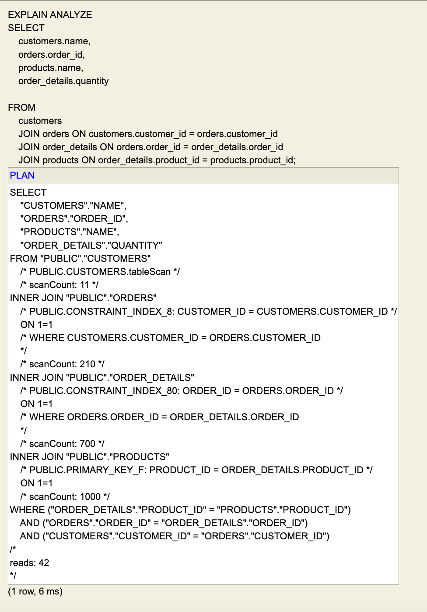
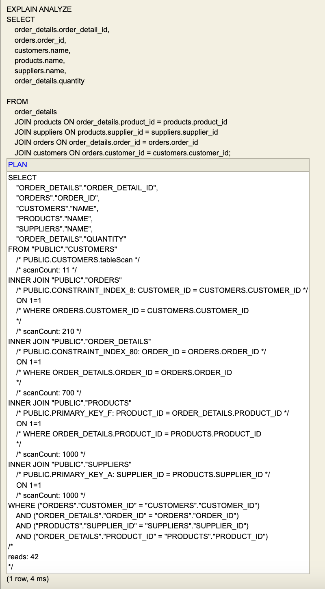
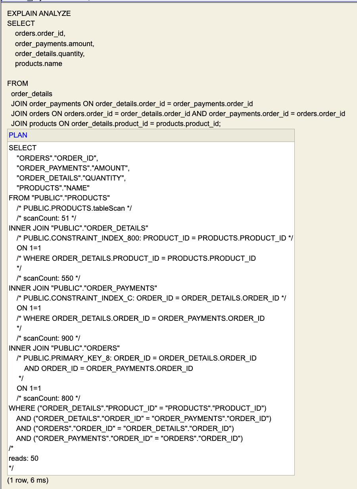

## Note about using mockito for unit tests
I could not for the life of me get the unit test case to run without build errors. With that being said, I checked to mkae sure my join orders were correct by looking at the output order of joins given by explain analyze. 

## Query from HW 4 Problem 4 
 
<screenshot of EXPLAIN ANALYZE>

 
<your explanation on whether you are satisfied that the above explain plan confirms the code changes that you made>
I am satisfied because this query only took 5ms to run as opposed to over a minute. This means my join order rules were more optimal. 
 
## HW 5 : Query 1 - Single Table
 
<screenshot of EXPLAIN ANALYZE>

 
 
<your explanation on whether you are satisfied that the above explain plan confirms the code changes that you made>
My output has not regressed the most basic functionality so I am satisfied.

 
## HW 5 : Query 2 - Just Two Tables
 
<screenshot of EXPLAIN ANALYZE>

 
<your explanation on whether you are satisfied that the above explain plan confirms the code changes that you made>
My output has not regressed the most basic functionality so I am satisfied.
 
## HW 5 : Query 3 - Three Tables
 
<screenshot of EXPLAIN ANALYZE>

 
<your explanation on whether you are satisfied that the above explain plan confirms the code changes that you made>
The required join order here is products -> order_details -> orders. I am satisfied because my EXPLAIN ANALYZE output shows the joins being done in this exact order.
 
## HW 5 : Query 4 - Four Tables
 
<screenshot of EXPLAIN ANALYZE>

 
<your explanation on whether you are satisfied that the above explain plan confirms the code changes that you made>
The required join order here is customers -> orders -> order_details -> products. I am satisfied because my EXPLAIN ANALYZE output shows the joins being done in this exact order.
 
## HW 5 : Query 5 - Five Tables
 
<screenshot of EXPLAIN ANALYZE>

 
<your explanation on whether you are satisfied that the above explain plan confirms the code changes that you made>
The required join order here is customers -> orders -> order_details -> products -> suppliers. I am satisfied because my EXPLAIN ANALYZE output shows the joins being done in this exact order. Also, good to note is that my rules basically followed what it did above before adding suppliers table on join. So it is consistent.
 
## HW 5 : Query 6 - Four Tables, More Options
 
<screenshot of EXPLAIN ANALYZE>

 
<your explanation on whether you are satisfied that the above explain plan confirms the code changes that you made>
The required join order here is products -> order_details -> order_payments -> orders. I am satisfied because my EXPLAIN ANALYZE output shows the joins being done in this exact order.
 
## Our rule based optimizer is still fairly limited.  Can you think of a query in which it would perform a fairly catastrophic join order?
 
< response >
For me what comes to mind is the case of a very selective WHERE clause that would be beneficial to add to the join order first. For example, let's say that for Query 5 you add a where clause for order_details that takes the number of rows from 500 to 5. The current rules based optimzier would take the loner route by starting wth the customer table. Although the time difference here isn't catastrophic, if we increase all other numbers we could create a catastrophic situation.

Another issue is that the rules based optimzer doesn't take into consideration primary keys and the speed that indices would add to joins. 
 
## Our rule based optimizer is still fairly limited.  If you were to improve it, what additional rules would you include?
 
< response >
I would probably add the issues I talked about above. Maybe first check for a where class that could drastically reduce row size. Then maybe implement a rule that uses indexed tables over non-index tables when given the option.
 
Details & Information
Assessment due date
3/28/25, 11:59 PM (EDT)
Grading
Maximum points
100 points
×